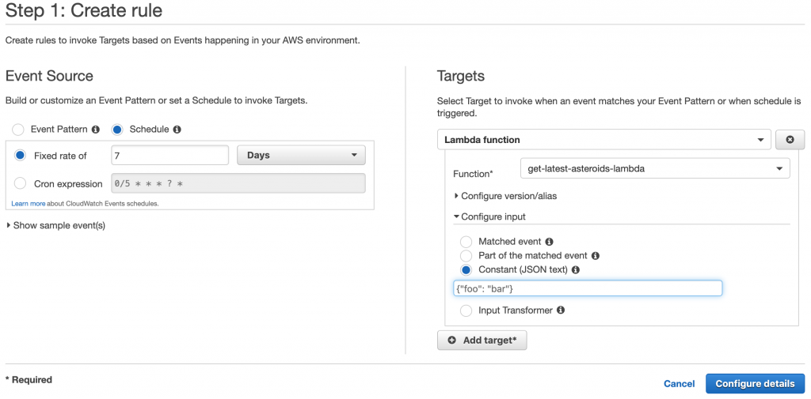

# Architecture

We're going to have a CloudWatch CRON Event trigger every week. This is just a timer you can have run on AWS to have it trigger various things at time intervals, like setInterval in JavaScript. It'll trigger a Step Function to load the latest asteroid data and load it into Dynamo. Here's a visual of what it is and we'll cover the pieces and data flow below.

</img>

In short, we're building:
- CloudWatch Event
- 1 Step Function
- 7 Lambdas
- 2 SQS Queues
- 1 S3 Bucket
- 1 DynamoDB Table
- 1 SNS Topic

## CloudWatch Event

CloudWatch is typically known for logs. It's where all your logs for all your services are. However, it also has 1 feature that has nothing to do with logs that is very useful for triggering things (Lambdas and/or Step Functions) and that is <a href="https://docs.aws.amazon.com/AmazonCloudWatch/latest/events/Create-CloudWatch-Events-Scheduled-Rule.html">CloudWatch Events Rules</a>. You can setup your rule to "run this Step Function every week" or "call this Lambda every 5 minutes for 5 days a week using this JSON". Since our satellite data can change monthly to weekly, we're going to have the database be updated or "rehydrated" every 7 days. While we're going to have AWS SAM create this for us, it looks something like this in the AWS Console. The cool thing about having AWS do this is the they manage the timer. You don't have to write Unix CRON jobs in some server/EC2.

</img>

## Step Function

A <a href="https://aws.amazon.com/step-functions/">Step Function</a>, often called a "State Machine", is just that... a <a href="https://jessewarden.com/2012/07/finite-state-machines-in-game-development.html">finite state machine</a>. They were built because you often will build a lot of microservices on AWS, whether all Lambdas, or many different types of technology, but had no central way to orchestrate and control them. You'd either have various Lambdas either trigger themselves, or use the <a href="https://docs.aws.amazon.com/step-functions/latest/dg/callback-task-sample-sqs.html">callback pattern</a>, or just try to be as <a href="https://www.reactivemanifesto.org/">reactive</a> as possible in your architecture. Sometimes you'd possibly have an orchestration service to handle everything, but that ended up being a monolith that "knew" about all services.

Step Functions have 5 features that are awesome that we're going to utilize:

- they can orchestrate calls to and from many Lambdas
- they take inputs just like Lambda functions do and pass their data through the various steps (in typical <a href="https://increment.com/software-architecture/primer-on-functional-architecture/">functional programming workflows</a>)  
- they are a big try/catch
- they can retry on errors
- they have a 1 year time limit to run</li></ol>
<!-- /wp:list -->

If you know anything about Functional Programming, you create functions that take inputs and return outputs. A "Lambda", taken from <a href="https://en.wikipedia.org/wiki/Lambda_calculus">Lambda Calculus</a>, is also a function that takes inputs and returns outputs. If you're building an API, it typically gets an event from API Gateway that is just JSON, and you return JSON back. Lambda called from an Application Load Balancer? Return JSON back. Lambda called from an SQS queue? You don't have to return anything, just don't throw, heh. The keys here:

- take input, return output
- easier if they take a single input and return a single output
- wire them together in a pipeline
- keep 'em <a href="https://theburningmonk.com/2018/01/aws-lambda-should-you-have-few-monolithic-functions-or-many-single-purposed-functions/">small and focused</a>
- let the Step Function handle if/then, try/catch/finally

Now, yes, we're not purely functional here. Our Lambda's will have a few side effects; that's what makes them interesting. But we'll make them as deterministic (predictable/easy to test) as possible. This in turn makes our Step Function as predictable/easy to test as possible.

The Step Function will orchestrate all our Lambdas to get the data in the pipeline and into Dynamo with a black and white answer: did the data get in there or not, and if not, can we retry?

## Lambdas

 Lambdas have a reputation for being "services" or "micro-services" and are often stereotyped as being triggered by <a href="https://aws.amazon.com/api-gateway/">API Gateway</a>. This means your function will get an HTTP request as JSON, and you return JSON that looks like an HTTP request back; API Gateway will then handle sending that back to the client. Poof: Serverless API's.

... that's not what we're building here. We're using Lambdas exactly what they're built on (which is in the name): Functions. That's why they're called Lambda functions. They get an <code>event</code>, and can return whatever you want. Some services have expectations about what you return (API Gateway, <a href="https://docs.aws.amazon.com/elasticloadbalancing/latest/application/introduction.html">Application Load Balancer</a>), but others don't care (Dynamo Streams), or just don't want you to crash (<a href="https://aws.amazon.com/sqs/">SQS</a>/<a href="https://aws.amazon.com/sns/?whats-new-cards.sort-by=item.additionalFields.postDateTime&amp;whats-new-cards.sort-order=desc">SNS</a>/<a href="https://aws.amazon.com/kinesis/">Kinesis</a>). This includes Lambdas calling other Lambdas, or Step Functions calling Lambdas. Think of it as functions calling functions like you do in Python/JavaScript/etc.

Here's our load out:

- **Create/Delete Table**: As you learn DynamoDB, it's nice to have a way to quickly delete and re-create your tables as you learn the data, and create indexes to query upon. Loading new data into an existing table can be confusing if you didn't mean to, so this ensures you start with a clean slate.
- **Download Delta-V**: Downloads the latest Delta Velocity (speed required to get to an asteroid) data, parses it out of HTML, and modifies it based on the Benner equations. Saves a JSON file to S3.
- **Download Exoplanets**: Downloads Exoplanet from the NASA Exoplanet Archive. Saves a JSON file to S3.
- **Calculate Masses**: Downloads static mass data for known asteroids/exoplanets and parses that data. Saves a JSON file to S3.
- **Get Latest Asteroids**: Downloads the latest asteroids from the NASA Jet Propulsion Laboratory database. It's a huge file, larger than Lambda can handle, so we have to stream it to S3.
- **Parse Horizon**: Merges all data and calculates asteroid value, then puts data on the SQS stream as its parsed.
- **Write To Dynamo**: Takes data from the SQS queue/stream, and writes to Dynamo. There could be many of these Lambdas running at one time. They are invoked by the SQS Queue, not the Step Function.

## SQS Queues

AWS calls it "Simple Queue Service", but most of us know it as a message queue or a more slang, not as accurate term, "message stream". A queue is better mainly because streams are more synonymous with Kafka/RabbitMQ  which AWS offers via <a href="https://aws.amazon.com/kinesis/">Kinesis</a> or <a href="https://aws.amazon.com/msk/">MKS</a>.

We're using a "Data" message queue because we can parse the data faster than it can be inserted into Dynamo. The way you do concurrency, or the <a href="https://theburningmonk.com/2018/04/how-to-do-fan-out-and-fan-in-with-aws-lambda/">fan out pattern using Lambda</a>, is run a bunch of the same Lambdas with different inputs. We can input the data as fast as we can to the SQS queue, and AWS will handle invoking our Lambdas with that data from SQS as fast as it can, with retry. Now, yes, if you use a language that supports parallelism/concurrency like Python/JavaScript/Go/Rust, etc. that can definitely be done. However, to teach you how to horizontally scale on AWS regardless of language, we'll let AWS do it for us. SQS queues are infinite, so it's ok if we parse ALL of the data (200,000 rows? or so) before we even write 1 record to Dynamo. SQS handles all the back pressure for us.

The second SQS queue is simply for us to let the Step Function know we've parsed all the messages successfully or unsuccessfully and only ever has 1 message on it.

## S3 Bucket

Given we're parsing various text data and modifying it, we could just send as JSON through the Step Function which supports up to 1 meg. However, there are 3 good reasons we're not doing this. First, our data may run over 1 meg since we don't control it. Second, S3 is made for handling large files. And third, this allows us to cache the data and re-run the Step Function in case of failures without having to hit our upstream services again if we don't need to. It also helps in debugging so we can see our data.

## DynamoDB Table

DynamoDB is a NoSQL style database where you inject random JSON and it'll store it. It's assumed at least one of the fields of your JSON is unique that you've identified ahead of time. Coming from Mongo, the queries were a LOT harder to wrap my head around at first, and the syntax is quite alien, but you'll get used to it once you practice a few times. We're going to store our asteroid data here. 

## SNS Topic

The Simple Notification Service is just an easy way for us to get an email once our Step Function is successful or fails. Once our Step Function is complete, we'll have it send a message to SNS, and that topic will send a notification to any subscriptions. For now we'll just use our email address.