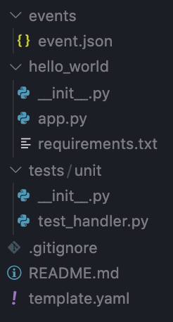

# Explore Dem Piles of Files

Let's take a look at what she made so you feel comfortable in your new surroundings. Open up in your favorite code editor. I'm using VSCode so I go `code .` and she'll open the current directory up.

</img>

Refer to the above screenshot, and I'll give ya a rundown of each folder and contents.

- **events**: This is where all of your stub events are, typically as JSON files. Lambda functions are typically invoked (called, run, executed, whatever) with JSON from some service. Examples include API Gateway which'll give you JSON that has all kinds of REST things in it like methodType (POST, GET, PUT, etc), DynamoDB streams which has records in it, SQS/SNS/Kinesis which have whatever the person put in them, or even other Lambda functions. As you get more Lambda functions, you'll probably get more stub events for that middle ground between unit and integration tests. More on these later.
- **hello_world**: This is the default Lambda function SAM generated. The `app.py` is your Lambda function, and `__init__.py` is that annoying module system Python uses to calm Java developers who like to create files feel more at home. The `requirements.txt` holds all the libraries your Lambda function needs. Those are installed via `pip -r requirements.txt`. It's similar to `package.json` in Node.js, or `build.sbt` in Scala. Each Lambda CAN share code with others, both locally and remotely on AWS, but SAM defaults to assuming each is its own thing. You'll be making more of these. I just copy pasta.
- **tests**: Holds all the unit tests for your Lambda function(s). This can get weird mixing multiple languages so don't be afraid to give up and capitulate to what your language of choice prefers (I'm being serious for a change, not sarcastic)
-  **template.yaml**: The most important file. This defines all your infrastructure and is compiled down to a CloudFormation template by SAM when you run `sam build`. You'll initially be spending a lot of time in here, but hopefully once you've been punched in the gut a few times by the horror that is YAML, you'll switch to <a href="https://dhall-lang.org/#">Dhall</a> to generate this. Still, I believe learning the hard way is the best way, so start here first to earn XP.

tl;dr; Write your code in `hello_world/app.py` and tweak your infrastructure settings in `template.yaml`, then run `sam build &amp;&amp; sam deploy`.