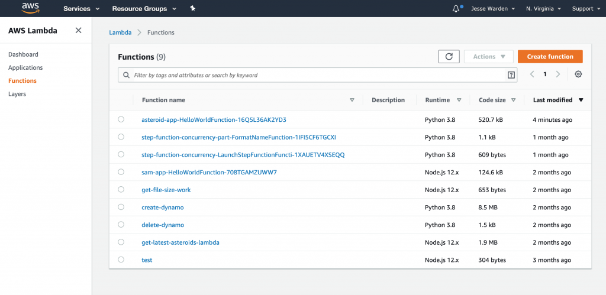
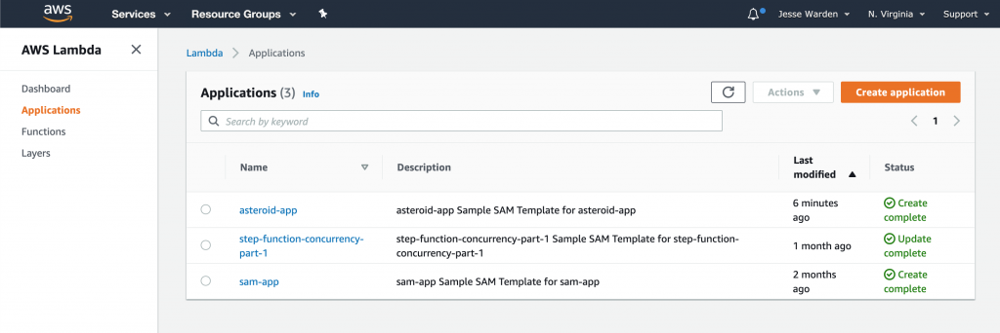
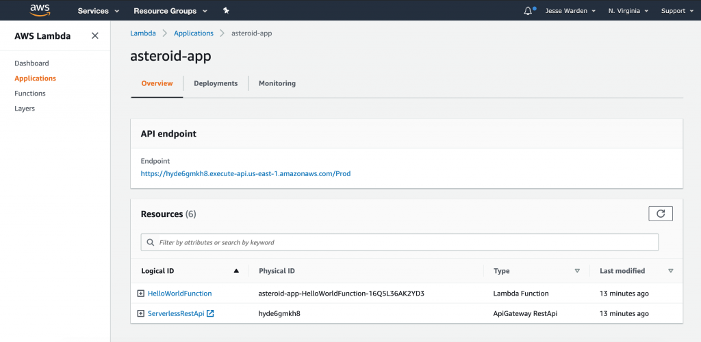
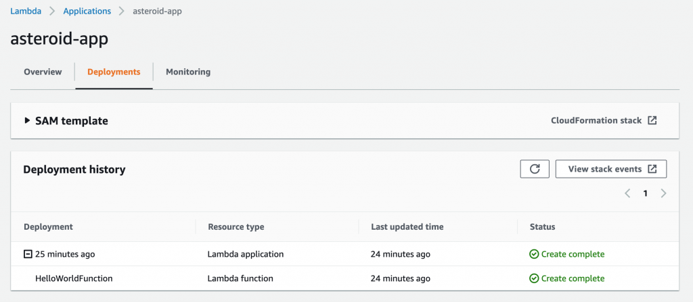
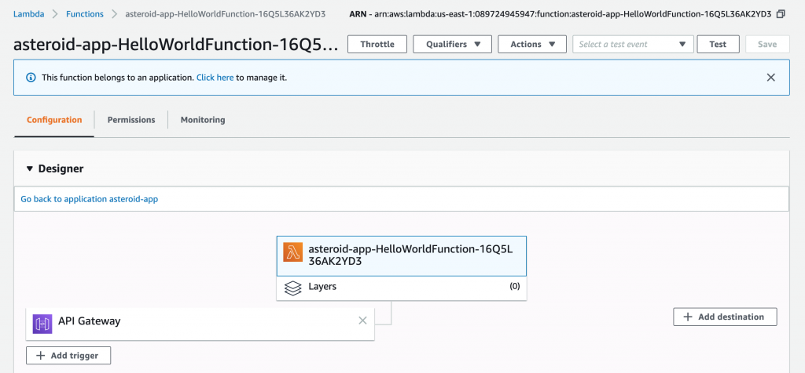

# Inspecting Deployed Resources

Open your AWS Console and navigate to Services > Lambda. Normally, you'd see a list of functions, filter to find your stuff, yadda yadda. However, I want you to check out something new; on the left side, click "Applications".

</img>

You should see "asteroid-app" or even "sam-app" in the list of applications.

</img>

Click your "asteroid-app".

</img>

Here is "all the stuff" you deployed. Basically if it's in the `template.yaml`, you'll see it here. No need to search various services and open 50 browser tabs. You can still open 50 tabs, but at least you can start here more quickly, heh. The default SAM app comes with a Lambda function and an API Gateway. For services that have important things related to them, like the URL for API Gateway, you'll see that above, in this case, the "API endpoint".

Now click the "Deployments" tab.

</img>

Here is what you've deployed. We only see one here, which is fine. When you deploy, CloudFormation is pretty good about only deploying what's actually changed. You'll see deployments that sometimes just have 1 Lambda function deployed despite being part of a lot more Lambda functions it works with.

The monitoring tab is nice in that you can see a grouped set of charts vs. having to open 50 tabs.

Go back to the Overview and click the HelloWorldFunction so we can see the Lambda it created directly.

</img>

You can see that it created the Lambda, and wired up the API Gateway trigger to it.
