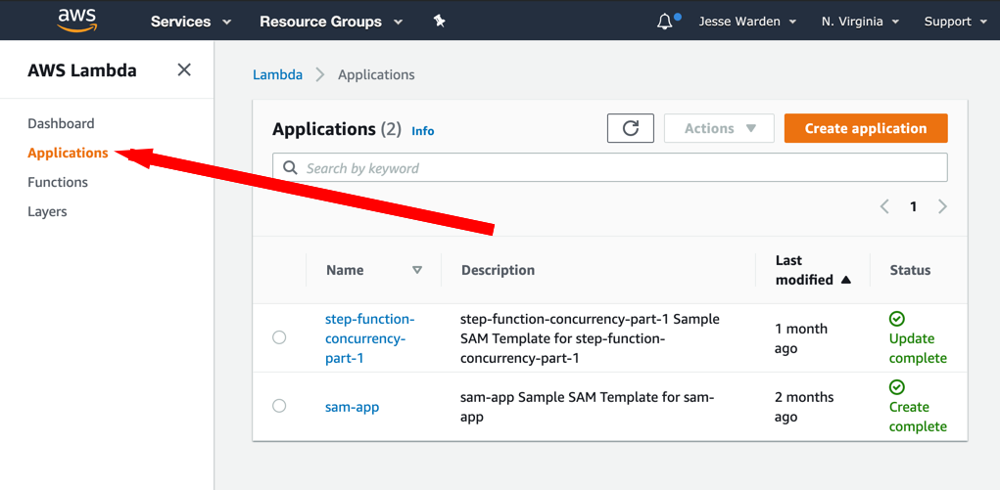

# Setup A Project

Open up a Terminal (I use the one built into VSCode but you can use emacs/vi/vsh if you danger-cray). Type `sam init`. It'll ask you what template source you want, choose 2 which is `python3.8` at the time of this writing. If they have a newer Python (lol, yeah right, not for another 10 years), then use that. Type 2 and hit enter. For project name, this'll be what your application is named. It's also the name given (kind of?) to your CloudFormation stack. Finally, it's the application you'll see in the left hand navigation of Lambda in the AWS Console that says "Applications". Name it whatever you want. We're going to call ours "asteroid-app".

</img>

When it asks what type, we'll choose `1. Hello World`; type 1 and hit Enter.