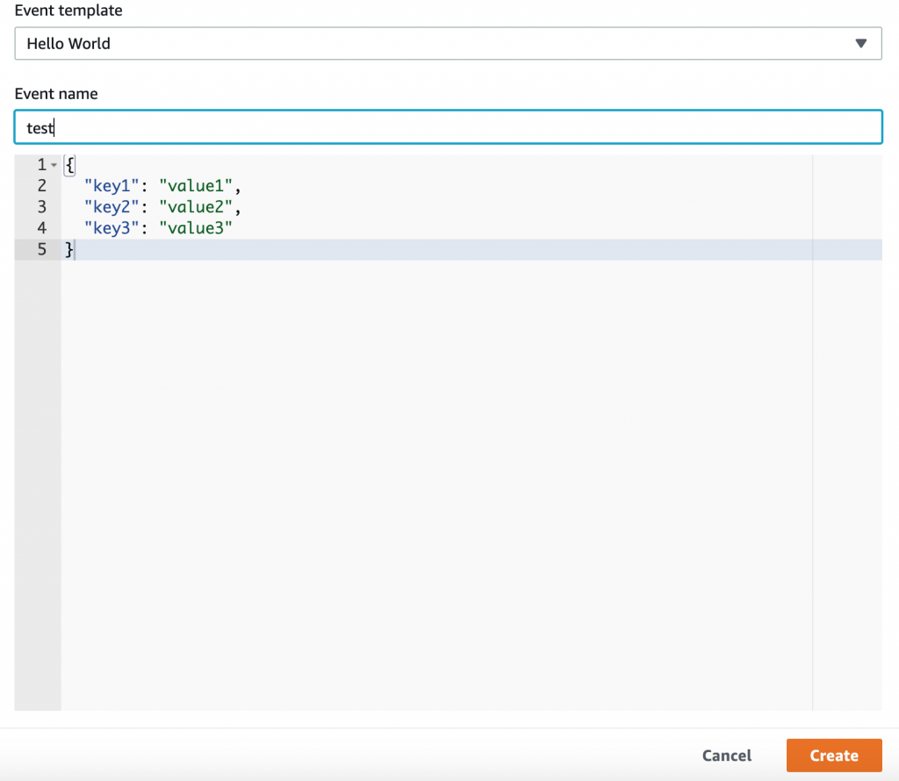
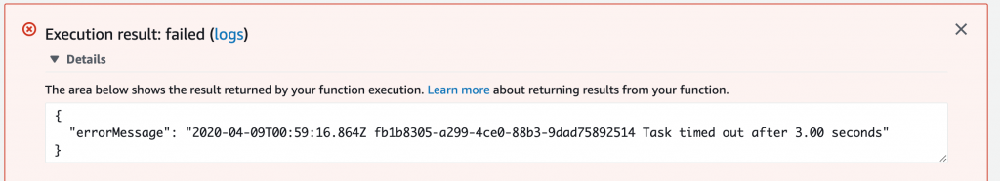
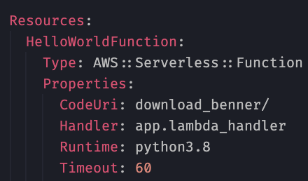
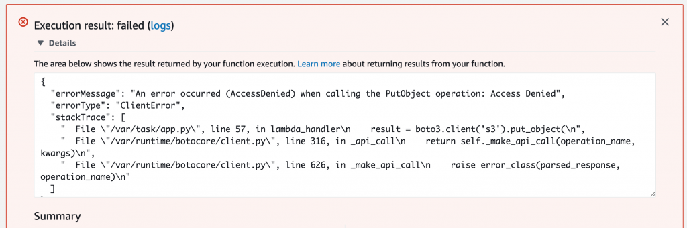
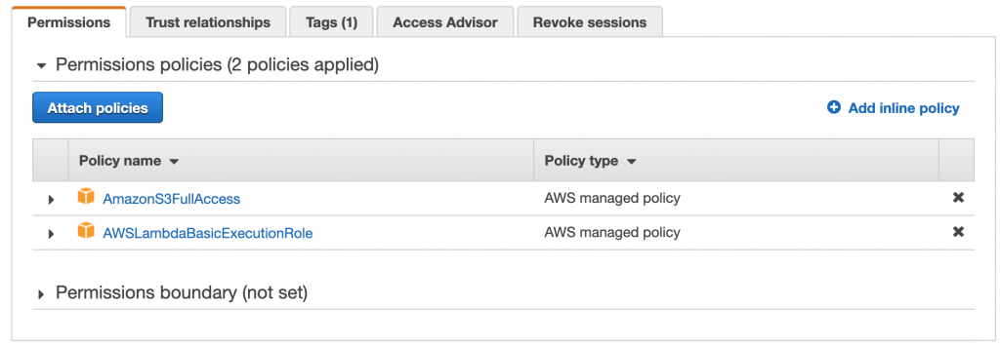

# Deploy The Toy & Iterate Till Great

`Now that you've changed the code, and it has reasonable error handling, let's deploy. Run `sam build &amp;&amp; sam deploy`. Once done, go see what it created by finding your Lambda (click your Application in Lambda &gt; Applications, or sort the list of Lambda functions by last updated time). Create yourself a test event and give it a name. The inputs do NOT matter since our function doesn't care what the input is.

</img>

`Once created, click "Test" again, and see it run (ensure you scroll up). Most likely, you'll get this error:

</img>

`Lelz. Downloading a file takes awhile, even though it's not too big. Go in your `template.yaml` and add a `Timeout: 60` so it only times out after 1 minute. That should be enough time, and if not, we can retry in the Step Function a few times, OR just increase it if it's commonly a slow file download operation. We're going for correctness here, not speed.

</img>

`Great, save and `sam build &amp;&amp; sam deploy`, then retest. You may get a new error:

</img>

`If you're not having SAM creating the IAM role for you, or you are, but it's not giving your Lamda permission, just edit to to have `s3:putObject`. I'm lazy and like making cyber people cry so added S3 Full Access 😈:

</img>

Clicking test again should yield a success. You can go look at your bucket to validate the file is there. Congratulations, you've created and deployed you first Lambda with helpful side effects using SAM that is super ready to be utilized in a Step Function.