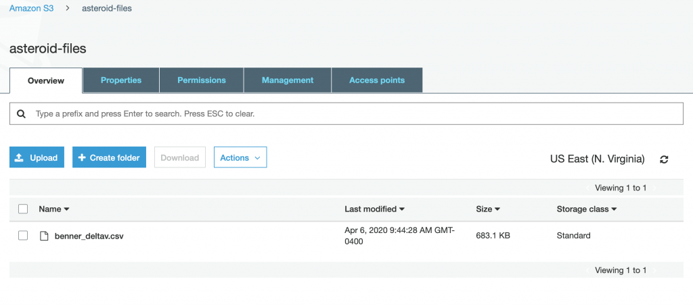

# Download Benner File Lambda

Open up your `app.py` from the `download_benner` folder, and let's code our first Lambda. She should look something like this:

```python
import json

def lambda_handler(event, context):
    return {
        "statusCode": 200,
        "body": json.dumps({
            "message": "hello world",
            # "location": ip.text.replace("\n", "")
        }),
    }

if __name__ == "__main__":
    print(lambda_handler({}, {}))
```


Let's start from nothing.

```python
def lambda_handler(event, context):
    pass

if __name__ == "__main__":
    print(lambda_handler({}, {}))
```


Rad, now when you go `python download_benner/app.py` she'll print out `None`. Notice the `context` as the 2nd parameter. This gives you interesting information for your Lambdas; how they were launched, how they're configured, etc. We're not going to use any of this so you can ignore it from now on. However, in Python, you can't omit arguments. If you call a function with 2 arguments, the function has to have 2 arguments in the function definition, else you'll get an exception. A common thing in Functional Programming to do when you don't care about arguments is to change them to an underscore which means "I don't care about this" or "I have no intention to use this argument at all". So let's do that. 

```python
def lambda_handler(event, _):
    pass
```


Let's download our file. We'll be using the URL library built into Python, and print out the text data it downloads.

```python
from urllib.request import urlopen

def lambda_handler(event, context):
    data = urlopen('http://echo.jpl.nasa.gov/~lance/delta_v/delta_v.rendezvous.html').read()
    return data
```


Now when you run this via `python download_benner/app.py` it should print gallons of text to the screen. Great! Now the data is HTML. If you wanna see it, <a href="https://echo.jpl.nasa.gov/~lance/delta_v/delta_v.rendezvous.html">go look at the page</a>. The HTML table is the good stuff. We need to parse that out. First, we'll have convert each line of text into a `List`. Python provides wonderful methods to work with `Lists`, next to none of which we'll use sadly.

```python
def lambda_handler(event, context):
    data = urlopen('http://echo.jpl.nasa.gov/~lance/delta_v/delta_v.rendezvous.html').read()
    lines = data.splitlines()
    return lines
```


Now when you run the code, she'll print the gallons of text again, but in `List` form.

The rest of the code required involves a <a href="https://docs.python.org/3/library/re.html">Regular Expression</a>, a <a href="https://docs.python.org/2/library/stringio.html">String buffer</a>, and a <a href="https://docs.python.org/3/library/csv.html">dictionary writer</a> for CSV files. It's really complicated, so we'll just abstract it into a function and ignore the details. The short version is "bunch of text goes in, a CSV file comes out" 😎.  She's a beast, ready?

```python
import re
import csv
from io import StringIO

def parse_csv(lines):
    r = re.compile((
            '\s*(?P&lt;rank>\d+)'
            '\s+(?P&lt;percentile>\d+\.\d+)'
            '\s+(?P&lt;name>\(\d+\)(\s+&#91;-\w ]+)?)?'
            '\s+(?P&lt;pdes1>\d+)'
            '\s+(?P&lt;pdes2>&#91;-\w]+)'
            '\s+(?P&lt;deltav>\d+\.\d+)'
            '\s+(?P&lt;h>\d+\.\d+)'
            '\s+(?P&lt;a>\d+\.\d+)'
            '\s+(?P&lt;e>\d+\.\d+)'
            '\s+(?P&lt;i>\d+\.\d+)'))
    fields = ('pdes', 'dv', 'H', 'a', 'e', 'i')
    f = StringIO()

    writer = csv.DictWriter(f, fieldnames=fields)
    writer.writeheader()

    c = 0
    for line in lines:
        c+=1
        if c &lt; 4:
            continue

        m = r.match(line.decode("utf-8"))
        if not m:
            continue

        writer.writerow({
            'pdes': ('%s %s' % (m.group('pdes1'), m.group('pdes2'))).strip(),
            'dv': m.group('deltav'),
            'H': m.group('h'),
            'a': m.group('a'),
            'e': m.group('e'),
            'i': m.group('i')
            })
    return f.getvalue().encode('utf-8')
```


tl;dr; "Create a regular expression to snag out the table, setup a CSV file for some of the fields in that table, write the csv to a string buffer in a loop, and return it after you've written all lines to the CSV".  Let's use the beast function:

```python
def lambda_handler(event, context):
    data = urlopen('http://echo.jpl.nasa.gov/~lance/delta_v/delta_v.rendezvous.html').read()
    lines = data.splitlines()
    csv = parse_csv(lines)
    return csv
```


Yet again, tons of text on the screen, except this time it's organized chaos. Wunderbar! We have our CSV file full of Benner equation velocity data. Now let's save to S3.

To do this, you'll need the <a href="https://aws.amazon.com/sdk-for-python/">AWS SDK for Python</a> which is called <a href="https://boto3.amazonaws.com/v1/documentation/api/latest/reference/services/index.html">boto3</a>. The AWS SDK let's you play with AWS services using code. We're going to be installing various libraries, for each Lambda.

## Quick Note on Installing Libraries in Python and Virtual Environments

How you do this in Python is the largest cluster flarge on the planet so choose whichever method you desire; seriously, no judgement zone. For this article, we're going to be using <a href="https://docs.python.org/3/tutorial/venv.html">virtual environment</a>. This will allow all libraries for each Lambda to be self-contained in that folder. When it's packaged up, SAM will call `pip install` on that particular Lambda, and she install only the libraries she needs, then have it all zipped up. Now _where_ you make the virtual environment is key, so I'm going to create it inside the `download_benner` folder. Since you initialized `sam init` for Python, it automatically created a `.gitignore` in your root directory with things like "Ignore any `env` folders you see, Git".

 I'll go `python -m venv download_benner/env` to create a virtual environment for that Lambda. I'm on a Mac so I activate it like `source download_benner/env/bin/activate`, but if you're PC then `download_benner/env/Scripts/activate.bat`.

**NOTE**: It's easy to forget you're in a virtual environment. If you start working on another Lambda, you don't want to accidentally install libraries in the wrong place. Either exit out of the virtual environment via `deactivate` or open a new Terminal so you can be in that Lambda without too much context switching. I often open multiple VSCode instances (Command + Shift + N), and each window with its own Terminal is for that Lambda. You can use the <a href="https://marketplace.visualstudio.com/items?itemName=johnpapa.vscode-peacock">VSCode Peacock extension</a> to customize the colors so each window is different looking. 

Let's install boto3 via `pip install boto3`.  Then add `import boto3` at the top of your `download_benner/app.py` and you're set for the next part.

Let's take that CSV we created and upload it to use later as well as to cache it.

```python
def lambda_handler(event, context):
    data = urlopen('http://echo.jpl.nasa.gov/~lance/delta_v/delta_v.rendezvous.html').read()
    lines = data.splitlines()
    csv = parse_csv(lines)
    result = boto3.client('s3').put_object(
        Bucket="asteroid-files", 
        Key="benner_deltav.csv", 
        Body=csv
    )
    return result
```


Before we run it, however, we'll need to actually _create_ the bucket. Let's open up our `template.yaml`, and add it right below our hello world function:

```yaml
AsteroidFilesBucket:
    Type: AWS::S3::Bucket
    Properties:
      BucketName: asteroid-files
```


Then run `sam build &amp;&amp; sam deploy`. You should see your new function code uploaded and the bucket created. Let's test our code now. Here's a possible output:

```json
{"ResponseMetadata": {"RequestId": "4374128A66D5521B", "HostId": "QxHqCs2gWw=", "HTTPStatusCode": 200, "HTTPHeaders": {"x-amz-id-2": "QxHqCVTEWw=", "x-amz-request-id": "4374128A66D5521B", "date": "Mon, 06 Apr 2020 13:44:28 GMT", "etag": ""bb94e638d39"", "content-length": "0", "server": "AmazonS3"}, "RetryAttempts": 0}, "ETag": '"bb9892ad8d39"'}
```

Rad, let's check our S3 bucket in the AWS Console:

</img>

Boo to the yaaaah. In 57 lines of code (10 for our handler) we've got the latest Delta Velocity Benner equations, parsed them out of HTML, converted to CSV, and uploaded to S3. This is why people like Python.