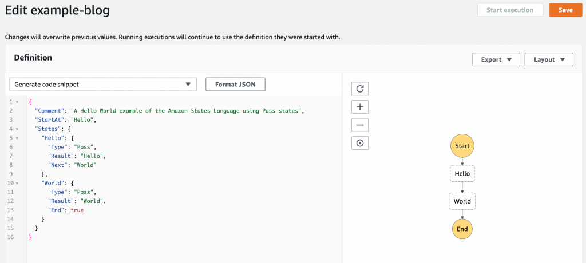
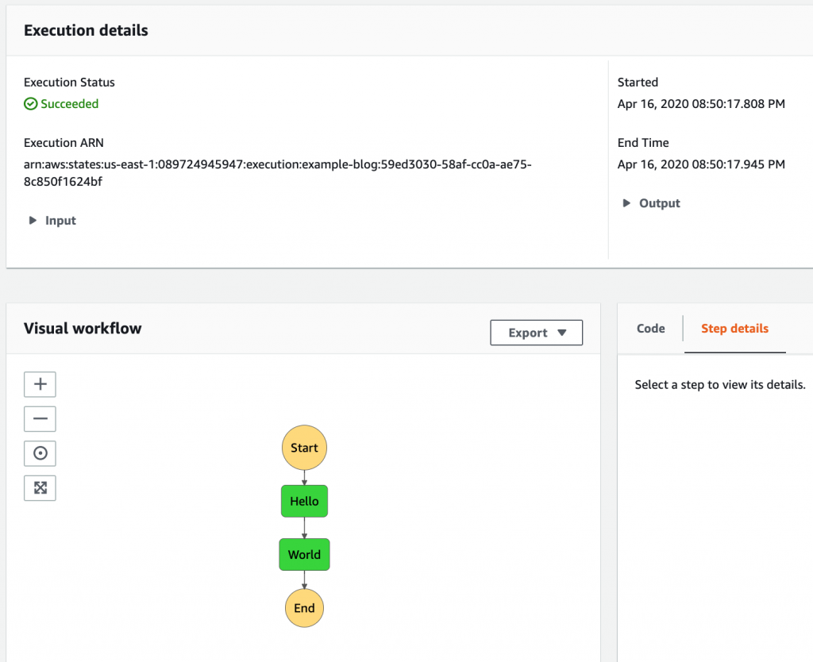

# Play With the Editor

Let's get your feet wet in the console first. It's more fun there, they have a constantly improving editor that helps you out, code generation, and you can visually see it + test it out. In the AWS Console, go "Services &gt; Step Functions" and follow the wizard to create a new one (NOT an Express one, regular flavor). Once done hit "Edit" so you can see her JSON markup and visual side by side. 

</img>

When we're done, the right side image will look like our original architecture diagram at the beginning of this article. For now, we'll start small. See the state `Hello`? Its output is the string "Hello". The `Result` attribute is a way to hardcode a return value. You can use `Pass` states as stubs for your other Lambda functions as you build your Step Function, for other services as you develop them, as well as `tap` functions (pure functions that log things). 

The `Pass` above in Python would look like this:

```python
def world():
  return "World"
```

Click "Save" and once complete, the "Start Execution" button should be abled.

An execution is what happens when you run your Step Function. When you run your code, that's an execution. Like `python main.py` or `javascript index.js`. It runs then stops (unless it's a server, then it eventually crashes). Typically "running your code" has some sort of output or logs. If you're an Imperative coder, you'll put prints/log statements. If you're in OOP, same thing. If you're an Functional programmer you'll use `tap` functions. By default, a Step Function just allows you to see the input a step gets, the output it has, and an Exception if any. The activity log below includes the Step Function itself. For example, sometimes the Step Function doesn't have permission to invoke a function for IAM Role reasons. So you'll see the input, but the Exception will be the Step Function's, not the Lambda's. Point is, same interface gives you all you need to know. Let's run the default one.

You'll see something like this:

</img>

Green is good. It means it worked. Your input was probably this:

```json
{
  "Comment": "Insert your JSON here"
}
```

That's the same if you wrote Python like this:

```python
def step_function(json):
  print(json)
```

Then when:

```python
def start_execution():
  input = """{
    "Comment": "Insert your JSON here"
  }"""
  json = json.loads(input)
  result = step_function(json)
```

Your Step Function gets an Input, but does not have to use it. You can treat it like functions in functional / reactive programming... or can ignore all of it and treat it like OOP classes and have side effects for everything and not care about input/outputs. Whatever you want. We'll do both.