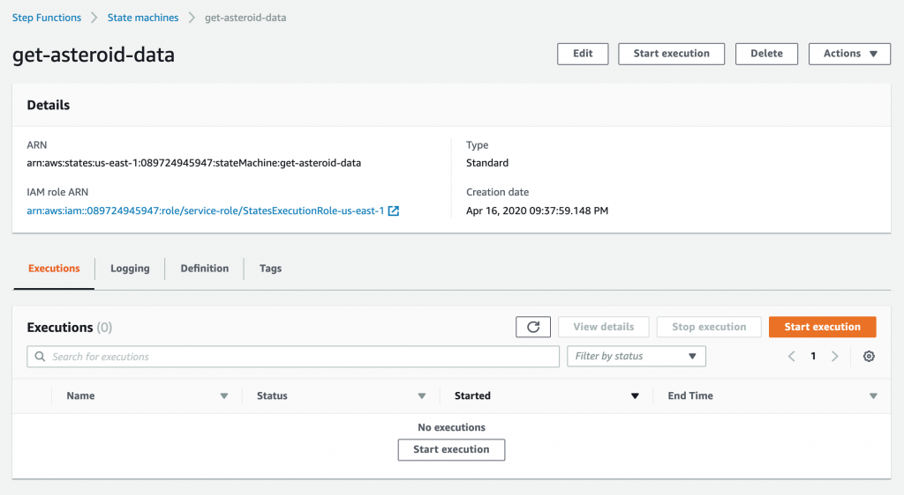

# Manually Testing Your Step Function

Go to your Step Function in the console.

</img>

Click the Start Execution button; again, just use the default JSON in there. Sit there and wait for her to finish. At the time of this writing, the page does auto-refresh and you can see the execution event history list below update dynamically. Once it gets to 100, you have to manually load more, but you don't have to. However, I've seen longer functions sometimes not refresh the page. Your function may be done, but the page doesn't refresh to show it. If you get impatient like I do, just Control + R a bunch of times until she's all green, a step is red or gray.

She'll probably turn red. Click the red bubble itself, and click on "Exceptions" to the right to see why.

</img>

Cool, so our first eror in a Step Function. Now what?