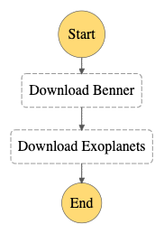

# Step Function Retry

Now that we have our Exoplanet Lambda ready, let's integrate her into the Step Function and show how we can better handle the errors.

In your `template.yaml`, let's add our new Lambda.

```yaml
"States": {
    "Download Benner": {
        "Type": "Task",
        "Resource": "${downloadBennerLambda}",
        "Next": "Download Exoplanets"
    },
    "Download Exoplanets": {
        "Type": "Task",
        "Resource": "${downloadExoplanetsLambda}",
        "End": true
    }
}
```

Notice a few important changes. First, our `Download Benner` state no longer has an `End`. We've replaced that with a `Next` that goes to the next state.

We've added the `Download Exoplanets` state, and put an `End` for it. Notice the `downloadExoplanetsLambda` variable is a new Lambda. Below in the Yaml, we put the new variable:

```yaml
- { downloadBennerLambda : !GetAtt DownloadBennerFunction.Arn,
    downloadExoplanetsLambda : !GetAtt DownloadExoplanetsFunction.Arn }
```

You're new Step Function resource should look like:

```yaml
GetAsteroidsDataStepFunction:
  Type: AWS::StepFunctions::StateMachine
  Properties:
    StateMachineName: get-asteroid-data
    RoleArn:
      !Sub
        - |-
          arn:aws:iam::${AWS::AccountId}:role/service-role/StatesExecutionRole-us-east-1
        - accountID: !Ref AWS::AccountId
    DefinitionString:
      !Sub
      - |-
        {
          "Comment": "Loads asteroid data from various NASA sources, parses, and puts into a database.",
          "StartAt": "Download Benner",
          "States": {
            "Download Benner": {
              "Type": "Task",
              "Resource": "${downloadBennerLambda}",
              "Next": "Download Exoplanets"
            },
            "Download Exoplanets": {
              "Type": "Task",
              "Resource": "${downloadExoplanetsLambda}",
              "End": true
            }
          }
        }
      - { downloadBennerLambda : !GetAtt DownloadBennerFunction.Arn,
          downloadExoplanetsLambda : !GetAtt DownloadExoplanetsFunction.Arn }
```

Run a `sam build && sam deploy` and let's go check her out. She'll end up looking like this:

</img>

Give her a spin and hopefully, you'll see a successful execution.

</img>

And your bucket should have 2 files:

</img>

## Retry

Rad, now time to make her super skrong. Let's check out the error handling and retry syntax for Step Functions:

```json
"Retry": [ {
   "ErrorEquals": [ "States.ALL" ],
   "Next": "ErrorState"
} ]
```

This is a basic error handling scenario. ANY error that happens in the Lambda, she'll be "caught" as it were in the `ErrorEquals` block. Think of `States.ALL` as a try/except for all errors. It'll go to the `ErrorState` if any error occurs. However, you can put many errors, and order matters. Let's put our custom HTTP one at the top and retry on it, but for general errors or all, just give up.

```json
"Retry": [
    {
        "ErrorEquals": [ "HTTPError" ],
        "IntervalSeconds": 10,
        "MaxAttempts": 3,
        "BackoffRate": 2
    }
],
"Catch": [
    {
        "ErrorEquals": [ "GeneralError", "States.ALL" ],
        "Next": "ErrorState"
    } 
]
```

This one is way more complex. Let's hit the first one. Our custom `HTTPError` is thrown if for whatever reason our HTTP request fails to download the exoplanet data from NASA's website. We'll just assume they're having web trouble, and retry.

We'll wait 10 seconds if that happens which is what `IntervalSeconds` means. This'll be one of our 3 retry attempts, which is what `MaxAttempts` means.

Now, `BackoffRate` is optional, but a common pattern. Instead of waiting 10 seconds, trying, failing, then trying again 10 seconds later, we actually wait longer the 2nd time, and even longer the 3rd time. This ensures if there are many of us, we don't bombard the NASA website with requests. We give it time to heal as it were. For example, AWS ECS/Batch can take about 2 to 3 minutes to come up, not including whatever their Docker containers are doing. Sometimes if you know what you're hitting you can just wait 3 minutes to wait for the server to come back up or a new set of containers to get spun up and be healthy. Either way, the `BackoffRate` will multiply your `IntervalSeconds` each time. So assuming we retry 3 times, it'll be:

Try -> Fail -> Wait 10 seconds -> Try -> Fail -> Wait 20 seconds -> Try -> Fail -> Wait 40 seconds -> Try -> Fail -> Task fails.

If all 3 tasks fail, OR we get some Step Function related error in there, our `Catch` will handle it, and since it "catches all", it'll just go to the "ErrorState".

We'll add just the retry for now into our `Download Exoplanets` Step Function defintion JSON. For the purpose of this article, we know to look for `HTTPError`, but I really liked an idea of my co-workers to use something called `Retriable` as it's very clear in the Step Function what you can do with it.

```yaml
"Download Exoplanets": {
    "Type": "Task",
    "Resource": "${downloadExoplanetsLambda}",
    "Retry": [
        {
            "ErrorEquals": [ "HTTPError" ],
            "IntervalSeconds": 10,
            "MaxAttempts": 3,
            "BackoffRate": 2
        }
    ],
    "End": true
}
```

Go ahead and `sam build && sam deploy` her.

## Testing Retriable Lambda

Now testing this functionality is a bit tricky. For now, let's just intentionally break it to more easily see the retry in action. Open up your `download` function and change the function from this:

```python
def download():
    try:
        result = urlopen(EXOPLANET_URL)
        ...
```

To this:

```python
def download():
    raise HTTPError('b00m')
    try:
        result = urlopen(EXOPLANET_URL)
        ...
```

Run `sam build && sam deploy`.

Start a new execution on your Step Function. Note, you may have to wait awhile on the 2nd step now as she'll take over a minute to complete intentionally waiting. Remember, one of the powers of Step Functions, their ability to run for a LOONNG time is also their curse.

Now, while it looks like it just threw an `HTTPError`...

</img>

... if you scroll down to the activity log, you'll see a different story. It successfully exited our `Download Benner` state, but had 4 errors in our `Download Exoplanets` state. If you open it up, it'll be our intentional `HTTPError`. Since we only retry 3 times, the 4th error is when it gave up.

</img>

## Clean Up

Great, so remove that `raise HTTPError('boom')` line, save, then run `sam build && sam deploy` to fix your Lambda.

You've now got a basic retry for failures that are possible to actually recover from. Rather than having to write stateful code for it, you let AWS handle that part.


