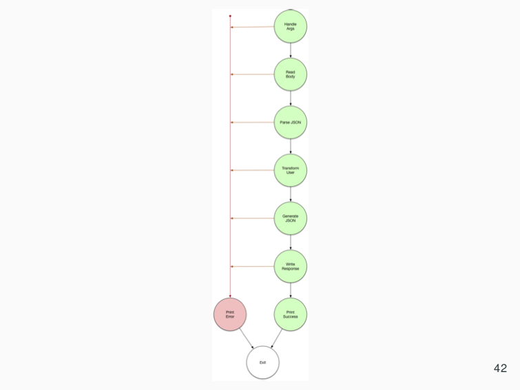

# The Setup

Do your copy pasta thing again; copy a Lambda folder and renmae it, then create a new resource in your `template.yaml`. Clear out `app.py` and just keep a handler there for now:

```python
def lambda_handler(event, context):
    return event
```

## Function Composition / Pipeline / Railway Programming

Whatever style of programming you call it, combining functions together with happy paths and stopping on a single error is an old, common pattern. So common in fact, the math geeks created a calculus for it, called Lambda Calculus. While we're creating Lambda functions, we're combining them together using a Step Function and letting him handle the data in, data out and error handling.

Replace the word "Lambda" with "Function" and it's conceptually the same thing: a function with a single input produces a single output. While Functional Programmers will start gnashing teeth about side effects and purity, ignore all that. Just focus on wiring together a bunch of functions, and only caring about the error in 1 place vs. scattered throughout the program's execution like in Golang style.

## Why Does This Matter?

The Golang style of coding functions is great. Each function clearly works, or it doesn't. If any error occurs, the program stops, and the error is returned from the function that failed. All functions can then be combined into more powerful functions, yet still follow the same rules, keeping the possible execution paths you have to keep in your head to 2.

... but HOW you write it still includes all those possible failures. What if we could reduce how much code you had to write, and only define failures in 1 place vs. all over the place?

There are opportunities here to take it farther and even remove null pointers (accessing a Dictionary key that doesn't exist), but we'll just handle errors like we have been and return to that part later.

## Dawg... an example, plz

When I was stuck writing Go, I happened upon [Rebecca Skinner's presentation](https://twitter.com/cercerilla/status/855189383716233221) on how to implement Promise/Future/Monad style programming in Go. Sadly it required interfaces which negates Go's typing. If you're learning Go, you _really_ need to keep those around until you get comfortable to escape.

However, the original slide in her presentation really sold it for me.

</img>

If you're familiar with any of the RX streaming libraries, like [RxJS](https://rxjs-dev.firebaseapp.com/), a lot of this will be familiar to you. Check out her previous slide which shows all the functions in green having their data come out and whatever they output goes to the next function in the line. If ANY have an error, it immediately stops and goes to the end.

</img>

