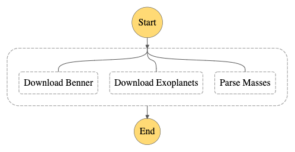

# Parallelism

You'll notice from our architecture digram that it appears that our `Benner`, `Exoplanet`, and `Masses` Lambdas are all happening at the same time.

</img>

Our current Step Function JSON tells another story:

```json
"States": {
    "Download Benner": {
        ...
        "Next": "Download Exoplanets"
        ...
    },
    "Download Exoplanets": {
        ...
        "End": true
        ...
    }
}
```

It is currently coded to download our Benner equations, then download the exoplanets, and finally we could add the masses after that. However, there is no reason to load 1 after the other. If each takes 1 second, that's 3 seconds we have to wait. However, if we did all 3 at the same time, then we'd only wait 1 second.

Now, that isn't much gain for changing some JSON, but it can have huge, positive gains for longer processes. More imporantly, if you're doing a lot of manual testing of Step Functions, it can really save you time throughtout the day.

## Parallel Task

If you need to do a bunch of things at once, but you don't really care about their inputs our outputs that much nor how many can run at once, the [Parallel](https://docs.aws.amazon.com/step-functions/latest/dg/amazon-states-language-parallel-state.html) Step Function task is awesome. We'll use it here to allow our 3 Lambdas that download files independently of eachother all at the same time. If any of the processes fail, the whole process will immeidately stop and fail, so no need to put catches for each individual state.

## Definition

We'll refactor our Step Function JSON defintion to use the Parallel task:

```json
...
"Download Initial Files": {
      "Type": "Parallel",
      "End": true,
      "Branches": []
      ...
```

We give it a name, "Download Initial Files" since we need to download all 3 files before we can process additional data later on in our Step Function. The Type is `Parallel`, which means any states that you put in this "Branches" array will run at the same time. They might not all _end_ at the same time, and that's fine; the Step Function will hold onto the results for you.

Let's move around our existing 2 states within it, and then add our new "Masses" Lambda to it.

```json
"Download Initial Files": {
  "Type": "Parallel",
  "End": true,
  "Branches": [
    {
      "StartAt": "Download Benner",
      "States": {
        "Download Benner": {
          "Type": "Task",
          "Resource": "${downloadBennerLambda}",
          "End": true
        }
      }
    },
    {
      "StartAt": "Download Exoplanets",
      "States": {
        "Download Exoplanets": {
          "Type": "Task",
          "Resource": "${downloadExoplanetsLambda}",
          "Retry": [
            {
              "ErrorEquals": [
                "HTTPError"
              ],
              "IntervalSeconds": 10,
              "MaxAttempts": 3,
              "BackoffRate": 2
            }
          ],
          "End": true
        }
      }
    },
    {
      "StartAt": "Parse Masses",
      "States": {
        "Parse Masses": {
          "Type": "Task",
          "Resource": "${parseMassesLambda}",
          "End": true
        }
      }
    }
  ]
}
```

Ok, quite the verbose syntax. Let's look at the important parts.

Notice in the `Branches` list there are 3 Objects. Those are are 3 states; the 3 lambdas to call. Each will be called at the same time. Notice there is no longer a `Next` in them. Instead, they are the only state to run in their "thread" as it were, and just exit. The Step Function will handle holding onto their input until the other tasks are done.

This _whole json thing_ is a State. So we'll just replace that in our original "States" JSON definition in our `template.yaml`.

Run a `sam build && sam deploy`.

## Update Step Function

Once deployed, she'll now look like so:

</img>

Start an execution to watch her go. When she's done, check out the output; it's now a `List`/`Array`, and has the result from each Lambda in there. If you've used JavaScript's `Promise.all` or Python's `asyncio.gather`, this may look familiar. Here's the truncated version:

```json
[
  {
    "ResponseMetadata": {
      "RequestId": "502CFBAF4D29DA5B",
      ...
      "HTTPStatusCode": 200
    }
  },
  {
    "ResponseMetadata": {
      "RequestId": "40C545287CBFD4BF",
      "HTTPStatusCode": 200
    }
  },
  {
    "ResponseMetadata": {
      "RequestId": "9BA73C256C4CD37D",
      "HTTPStatusCode": 200
    }
  }
]
```

The order of those responses is the order in which you put the states, regardless of when they finished.